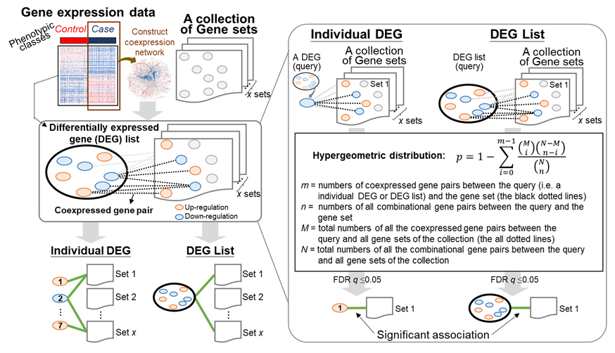

## Gscore
The **Gene Set Correlation Enrichment Analysis** (Gscore) is a powerful pathway analysis method implemented in Python. Gscore is designed to uncover meaningful relationships among genes. By evaluating coexpressed gene pairs within a set of Differentially Expressed Genes (DEGs), Gscore identifies enriched patterns in comparison to a broader collection of DEGs, often organized as gene sets like pathways. Leveraging gene expression data, Gscore constructs a coexpression network to illuminate how groups of genes collaborate, offering insights into their potential functional interactions.

## Online Service
The register-free online tool is available on: https://gscore.ibsb.nycu.edu.tw/

## Overview
  
  
The Gscore method evaluates the enrichment of coexpressed gene pairs between the differentially expressed genes (DEGs) of the query DEG list and collection of gene sets using the gene expression data with samples belonging to two classes as follows.

(1) For each input gene expression data, two DEGs with |Pearson’s correlation coefficient| ≥ c (|Pearson’s r| ≥ c) across case samples were considered a coexpressed gene pair. Here, c can be set by the users, for example, 0.3 (low), 0.5 (moderate), or 0.7 (high). Please note that the gene with all identical expression values across all "case" samples will be ignored when calculating the correlation.

(2) For each DEG as an involved gene in the query DEG list, the Gscore method first used the coexpressed gene pairs between it and the DEGs of a gene set in the selected collection to determine its association significance for this gene set based on the hypergeometric distribution as  

$$\Large p=1-\sum^{m-1}_{i=0}\frac{\binom{M}{i}\binom{N-M}{n-i}}{\binom{N}{n}}$$  

where m and n are the numbers of coexpressed gene pairs and all the combinational gene pairs, respectively, between each DEG in query DEG list and all the DEGs in a specific gene set; 
(iii)	For the query DEG list, Gscore further measured the statistical significance of association for a specific gene set based on the coexpressed gene pairs between all of the involved DEGs and all the DEGs of this gene set in the selected collection. Then, we computed the p value of the hypergeometric distribution as follows:  

$$\Large p=1-\sum_{i=0}^{m_g-1}\frac{\binom{M_g}{i}\binom{N_g-M_g}{n_g-i}}{\binom{N_g}{n_g}}$$  

where $m_g$ and $n_g$ are, respectively, the numbers of coexpressed gene pairs and all possible gene pairs between all the DEGs of the query list and all the DEGs in a specific gene set. More detail information is available on the tutorial of the website: https://gscore.ibsb.nycu.edu.tw/tutorial.html

